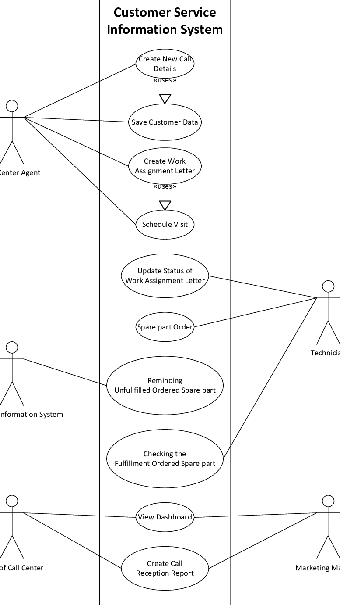

# Nissan Gateway 

#
### Frameworks

*  - [WordPress](https://wordpress.com/)
*  - [woocommerce](https//https://woocommerce.com/)

### Customer Management System
*  Customer Management System assists the companies in maintaining contact with costumers, streamlining procedures, and boosting profitability. In addition, this system enables the company to manage and communicate with the clients. Thus, this provides the clients feel connected to company businesses. 

### Sub System
*Client Database and Connection
*Organization and Distribution
*Admin System

'

